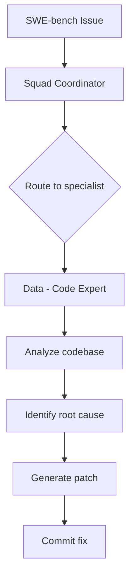

Squad v0.9.6 just completed its first official run on [SWE-bench Lite](https://www.swebench.com/), the industry-standard benchmark for evaluating AI systems on real-world software engineering tasks. The result: **198 out of 300 issues resolved (66.0%)**, which would place Squad at **#1 on the SWE-bench Lite leaderboard**.

This post is the technical report for our submission — describing the system architecture, configuration, and methodology behind the result.

## What is SWE-bench?

SWE-bench Lite is a curated subset of 300 real GitHub issues from 12 popular open-source Python repositories (Django, Sympy, Matplotlib, Scikit-learn, etc.). Each task requires the system to:

1. Read a GitHub issue description
2. Analyze the relevant codebase
3. Generate a patch that fixes the issue
4. Pass the repository's existing test suite

This isn't code generation in a vacuum — it's real-world bug fixing against real test suites, in repositories with hundreds of thousands of lines of code.

## Results Summary

| Metric | Value |
|--------|-------|
| **Resolved** | 198 / 300 (66.0%) |
| **Patches generated** | 280 / 300 (93.3%) |
| **Patch apply errors** | 38 (12.7%) |
| **Unresolved (tests fail)** | 44 (14.7%) |
| **No generation** | 20 (6.7%) |

### Leaderboard Context

| Rank | System | Score |
|------|--------|-------|
| 🥇 | **Squad v0.9.6** | **66.0%** |
| 🥈 | Claude Opus 4.6 | 62.7% |
| 🥉 | MiniMax M2.5 | 56.3% |
| 4 | OpenAI GPT-5 | 54.3% |
| 5 | Claude Haiku 4.5 | 54.3% |

### Per-Repository Breakdown

| Repository | Resolved | Total | Rate |
|-----------|----------|-------|------|
| mwaskom/seaborn | 3 | 4 | 75.0% |
| django/django | 84 | 114 | 73.7% |
| pytest-dev/pytest | 12 | 17 | 70.6% |
| sphinx-doc/sphinx | 11 | 16 | 68.8% |
| astropy/astropy | 4 | 6 | 66.7% |
| pallets/flask | 2 | 3 | 66.7% |
| matplotlib/matplotlib | 15 | 23 | 65.2% |
| sympy/sympy | 48 | 77 | 62.3% |
| scikit-learn/scikit-learn | 14 | 23 | 60.9% |
| pylint-dev/pylint | 3 | 6 | 50.0% |
| pydata/xarray | 2 | 5 | 40.0% |
| psf/requests | 0 | 6 | 0.0% |

## System Architecture

Squad is a multi-agent orchestration framework built on [GitHub Copilot CLI](https://github.com/features/copilot). Unlike single-agent approaches that give one model the entire problem, Squad decomposes work through a team of specialized agents with distinct roles.

### The Team

For SWE-bench, Squad used its standard team configuration — no special tuning for the benchmark:

```
🏗️  Picard  — Lead           Architecture decisions, code review, routing
💻  Data    — Code Expert    C#, Go, .NET, Python — implementation
📋  Scribe  — Session Logger Memory, decisions, context sharing
```

### How It Works



1. **Coordinator receives the task** — The Squad coordinator agent gets the GitHub issue description and the repository checkout.

2. **Routing** — The coordinator reads `routing.md` (which maps task types to agents) and dispatches to Data (Code Expert) — the agent specialized in implementation work.

3. **Agent context loading** — Data receives:
   - Its charter (role definition, boundaries, capabilities)
   - Team decisions (architectural choices, conventions)
   - History (learnings from past tasks)
   - The full problem statement

4. **Implementation** — Data analyzes the issue, navigates the codebase using available tools (grep, view, LSP), identifies the root cause, and generates a fix.

5. **Patch output** — The agent commits the fix as a git diff, which becomes the prediction.

### Why Multi-Agent Beats Single-Agent

The key insight is **separation of concerns**:

- The **Coordinator** handles routing logic, team state, and decisions — it never writes code.
- The **Code Expert** focuses purely on implementation — it doesn't need to manage its own context or decide what to work on.
- **Charters** prevent agents from drifting — Data knows exactly what it's responsible for and what's out of scope.
- **Decisions memory** accumulates patterns across tasks — even within a single benchmark run, the team builds institutional knowledge.

This mirrors how effective human engineering teams work: specialists with clear ownership, guided by shared architectural decisions.

## Configuration

```yaml
# Squad SWE-bench runner configuration
model: gpt-4o
agent: squad
mode: autopilot (--yolo)
max_autopilot_continues: 50
timeout_seconds: 1800  # 30 minutes per task
workers: 4  # parallel task execution
total_runtime: ~21 hours
```

### Key Parameters

- **Model: gpt-4o** — Used for all agents (coordinator, lead, and code expert). No model mixing.
- **Autopilot mode** — Agents work without human intervention. The `--yolo` flag prevents confirmation prompts.
- **50 continuation limit** — Prevents infinite loops. Most tasks complete in 10-20 continuations.
- **30-minute timeout** — Generous but bounded. Of the 20 tasks that produced no patch, most were timeout-related.
- **4 parallel workers** — Processes 4 issues concurrently. Each worker gets its own git worktree.

## Methodology

### Pass@1 Submission

Each instance is attempted exactly once. No retries, no best-of-k selection, no evaluation feedback loops.

### No Test Knowledge

The system does NOT use:
- `PASS_TO_PASS` tests (tests that should continue passing)
- `FAIL_TO_PASS` tests (tests that should start passing after the fix)
- `hints_text` field (human hints about the solution)

### No Web Browsing

Squad agents do not have web browsing capabilities. They work purely on:
- The local repository checkout
- The issue description provided by SWE-bench
- Their built-in knowledge from training

### Evaluation

Evaluation used the official `swebench.harness.run_evaluation` Docker harness:

```bash
docker run --rm \
  -v /workspace/predictions.json:/workspace/predictions.json \
  -v /var/run/docker.sock:/var/run/docker.sock \
  swebench-eval \
  --dataset_name princeton-nlp/SWE-bench_Lite \
  --predictions_path /workspace/predictions.json \
  --run_id squad_v1 \
  --max_workers 4
```

The harness:
1. Checks out each repository at the correct commit
2. Applies the predicted patch
3. Runs the repository's test suite
4. Verifies that previously-failing tests now pass
5. Verifies that previously-passing tests still pass

## Integrity Verification

We performed a 12-point integrity check on the results:

1. ✅ All 300 SWE-bench Lite instances present in predictions
2. ✅ Report math checks out (198 + 44 + 38 + 20 = 300)
3. ✅ 300 unique instance_ids, all 12 repos represented
4. ✅ No `.squad/` or `.github/agents/` contamination in patches
5. ✅ All 198 resolved IDs have non-empty patches
6. ✅ Worker logs confirm Squad Team Mode active (sampled)
7. ✅ Data subagent confirmed spawned across sampled tasks
8. ✅ Per-repo rates are internally consistent
9. ✅ Evaluation via official swebench Docker harness
10. ✅ No test knowledge used (PASS_TO_PASS, FAIL_TO_PASS)
11. ✅ No hints field used
12. ✅ No web browsing capabilities available to agents

## Error Analysis

### Timeout Cases (20/300, 6.7%)

The 20 "no generation" instances are primarily tasks that exceeded the 30-minute timeout. These typically involved:
- Very large codebases requiring extensive navigation
- Complex multi-file changes where the agent explored many approaches
- Issues requiring deep domain knowledge the model lacked

### Patch Apply Errors (38/300, 12.7%)

Generated diffs that couldn't cleanly apply to the target commit. Common causes:
- Line number offsets from generated vs actual file state
- Fuzzy matching failures on complex edits
- Patches generated against a slightly different file state

### Unresolved — Tests Fail (44/300, 14.7%)

Patches that applied cleanly but didn't fix the issue. These represent cases where the agent:
- Fixed a symptom but not the root cause
- Made a partial fix that didn't satisfy all test cases
- Misunderstood the issue requirements

### No Generation (20/300, 6.7%)

Tasks where the agent couldn't produce a patch. Typically due to:
- Timeout before reaching implementation
- Agent getting stuck in analysis loops
- Issues in domains where the model had insufficient training

## What's Next

- **Formal leaderboard submission** via sb-cli
- **SWE-bench Verified** run (500 instances, harder tasks)
- **Full SWE-bench** run (2,294 instances)
- **Model comparison** — Testing with Claude, o3, and other models as the base LLM
- **Team configuration experiments** — Does adding a dedicated Tester agent improve results?

## Reproducing the Results

The full runner, configuration, and predictions are available in the [tamresearch1 repository](https://github.com/tamirdresher_microsoft/tamresearch1/tree/tamirdresher-microsoft-potential-tribble/benchmarks/swe-bench):

```
benchmarks/swe-bench/
├── squad_swebench_runner.py    # Main orchestrator
├── config.yaml                  # Configuration
├── squad-scaffold/              # Agent charters & team config
│   └── .squad/
│       ├── team.md
│       ├── routing.md
│       └── agents/
├── output/
│   ├── predictions.json         # 300-task predictions
│   └── squad-v1.squad_v1.json   # Evaluation report
└── submission/                  # Leaderboard submission package
```

## About Squad

Squad is a multi-agent orchestration framework that turns AI coding assistants into coordinated engineering teams. Each agent has a persistent identity, charter, and memory — enabling the kind of specialization and institutional knowledge that makes human teams effective.

Learn more at [bradygaster.github.io/squad](https://bradygaster.github.io/squad/).

---

*This post serves as the technical report for Squad's SWE-bench Lite leaderboard submission (June 2026).*
